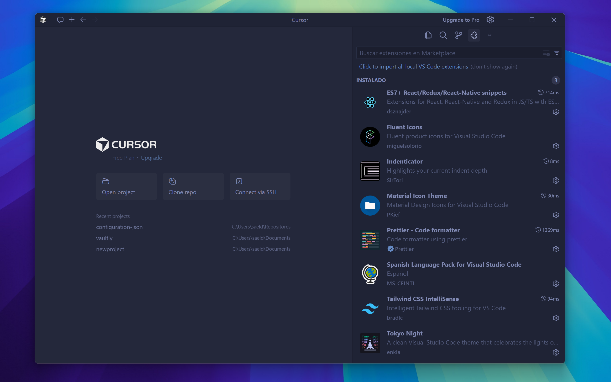

# VS Code Custom Configuration

This is the technical documentation of the custom Visual Studio Code configuration, focused on minimalism, visual efficiency, and a premium aesthetic development experience.

  

## 🚀 Compatibility

This configuration has been tested and is fully functional in the following editors:
- **VS Code** (Primary environment)
- **Cursor** (AI-powered code editor)
- **Antigravity** (AI Coding Assistant)

## ✨ Transformation (Before & After)

Below you can see the comparison between the default layout and the customized minimal interface.

  <table>
    <tr>
      <td align="center"><b>Default Configuration</b></td>
      <td align="center"><b>Customized Interface</b></td>
    </tr>
    <tr>
      <td></td>
      <td></td>
    </tr>
  </table>

## 🎨 Appearance and Theme

The interface is configured to be clean and focused on code, removing distracting elements like the status bar, activity bar, and breadcrumbs.

| Element | Configuration |
| :--- | :--- |
| **Color Theme** | [Tokyo Night Storm](https://marketplace.visualstudio.com/items?itemName=enkia.tokyo-night) |
| **Icon Theme** | Material Icon Theme |
| **Product Icon Theme** | Fluent Icons |
| **Side Bar** | Located on the **right** (to prevent code jumping) |
| **Tabs** | Hidden (Full minimalism) |
| **Minimap** | Disabled |

  

## ✍️ Typography and Text Style

A modern font with ligatures and specific weights is used to improve readability.

- **Font Family:** `'JetBrains Mono'`, Consolas, 'Courier New', monospace.
- **Font Weight:** `300` (Light) for a more refined look.
- **Ligatures:** Enabled for better representation of operators (`=>`, `===`, `!=`).
- **Custom Syntax Highlighting:**
  - **Keywords:** (bold) to highlight language structure.
  - **Functions:** Regular style for visual balance.

## 🛠️ Editor Behavior

Settings to improve automatic workflow and navigation.

- **Formatting:** Automatic on save (`formatOnSave: true`).
- **Default Formatter:** [Prettier](https://marketplace.visualstudio.com/items?itemName=esbenp.prettier-vscode).
- **Auto-Save:** Activated after a short delay (`afterDelay`).
- **Cursor:** Smooth animation (`smoothCaretAnimation`) and expanded blinking style.

  

## 📂 Explorer and Terminal

- **Explorer:** `compactFolders: false` (Shows full folder hierarchy).
- **Confirmations:** Disabled for deleting/moving files.
- **Terminal:** Default profile configured as **Git Bash**.
- **Navigation:** Breadcrumbs disabled to save space.

---

## 📄 settings.json File

  <a href="./settings.json">
    <kbd>📁 View full settings.json file</kbd>
  </a>

